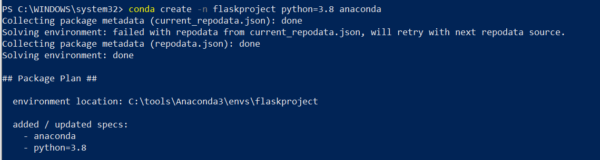
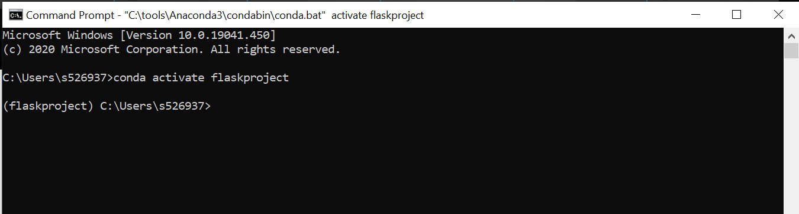
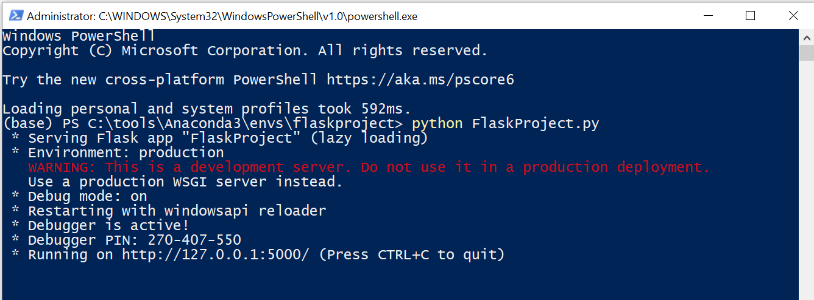
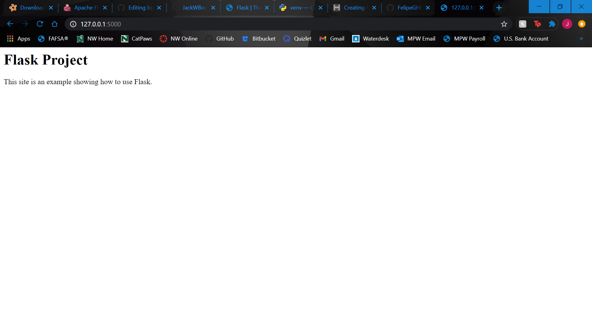

# demostration_project_for_phython-flask-flutter

## Contributors
- [Felipe](https://github.com/FelipeGHB/about-felipe)
- [Jack W Beaver](https://github.com/JackWBeaver) <br>
<br>

## About This Project
In this project, we will use Python to show what Flask and Flutter is, as well as their capacities and simple skills for both frameworks.

### Tools Needed
- [Phython](https://www.python.org)
- [Flask](https://flask.palletsprojects.com/en/1.1.x/)
- [Flutter](https://flutter.dev)
- Powershell
- Anaconda3
- Command Prompt
- Visual Studio Code

## Flask
Jack will demonstrate how to download Flask and a basic overview of what it does.

### Tools Needed
- Anaconda3 (Python)
- [Flask](https://flask.palletsprojects.com/en/1.1.x/)
- Powershell
- Command Prompt
- Visual Studio Code

### Introduction
Flask is a micro web framework that is written in the Python programming language to create APIs. It does not really require any tools or libraries, nor does it have any database components. It is referred to as a microframework that keeps the core "simple and also extensible". Flask uses local objects internally so that you (the creator) don't have to pass objects from function to function in order to stay safe.

### Installation
Open up PowerShell as Administrator
Install and update with (**Note:** If you already have Anaconda3 downloaded then you already have Flask downloaded):
```Powershell
pip install -U Flask
```
Create a virtual environment (flaskproject will be whatever you want to name you environment and python=your version):
```Powershell
conda create -n flaskproject python=3.8 anaconda
```


Open up the command prompt and activate your virtual environment:
```CMD
conda activate flaskproject
```


Your virtual environment is now ready to go!

### Running Your API
Create a python file in visual studio code to use for your API (Make sure to **save** your .py file in your project folder):
```Python
import flask

app = flask.Flask(__name__)
app.config["DEBUG"] = True


@app.route('/', methods=['GET'])
def home():
    return "<h1>Flask Project</h1><p>This site is an example showing how to use Flask.</p>"

app.run()
```
Go back to your Powershell window to run your project:
```Powershell
python FlaskProject.py
```


Copy and your generate URL from Powershell (see picture above) and paste into Chrome:


You have successfully created an API with Flask!

### References
- Source showing information and a "User's Guide" for Flask: https://flask.palletsprojects.com/en/1.1.x/
- Installation Link for Flask: https://pypi.org/project/Flask/
- Help for creating a virtual environment: https://uoa-eresearch.github.io/eresearch-cookbook/recipe/2014/11/20/conda/
- Source for running API: https://programminghistorian.org/en/lessons/creating-apis-with-python-and-flask

#### Link to Demonstration Video
[FlaskDemo](https://use.vg/90oLww)

## Flutter
Felipe will be discussing Flutter.
